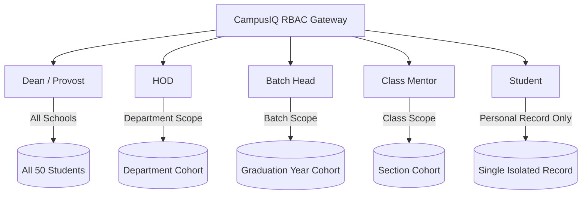

# CampusIQ 
### Student Success & Retention Intelligence System
> **AI-Powered Academic Telemetry, Multi-Vector Success Scoring & Automated Retention Interventions**

[](https://nodejs.org/)
[](https://expressjs.com/)
[](https://tailwindcss.com/)
[](https://www.chartjs.org/)
[](#automated-intervention-generation)
[](LICENSE)

---

## Overview

**CampusIQ** is a comprehensive academic analytics and retention intelligence platform built for modern universities and colleges. Rather than relying on simple, lagging grade reports, CampusIQ synthesizes student data across **7 weighted telemetry vectors** to compute a real-time **Student Success Score (0–100)**, identify critical retention risks early, and generate actionable, personalized recovery plans powered by local LLM intelligence.

The platform provides a unified experience with strict **Role-Based Access Control (RBAC)**, allowing Deans, HODs, Batch Heads, Mentors, and Students to access the exact level of data fidelity they are authorized to view.

---

## Key Features

### 1. Role-Based Access Control (RBAC) Gateway
Accessible via a centralized login page (`/login`):
* **Dean / Provost (`?role=dean`)**:
  - Full institutional governance across all schools and departments.
  - Institution-wide 7-vector spider chart, accreditation targets, cross-department benchmarking.
  - Custom dataset upload and database factory reset controls.
* **Head of Department - HOD (`?role=hod&department=...`)**:
  - Filtered to department-specific student cohorts (CSE, IT, ECE, DSAI).
  - Subject score spread (Midsem vs. Endsem), backlog audit, departmental top & weak performers.
* **Batch Head (`?role=batch_head&batch=...`)**:
  - Filtered to specific graduation year cohorts (e.g., Batch 2024–2028).
  - Placement drive readiness and long-term trajectory metrics.
* **Class Mentor (`?role=mentor&class=...`)**:
  - Section-scoped cohort (e.g., CSE-A).
  - Granular attendance tracking (lectures, remedial classes, labs).
  - One-click trigger for personalized student interventions.
* **Student Portal (`?role=student&id=...`)**:
  - **Zero peer exposure**: Strict single-record isolation.
  - Personal 7-Vector Competency Radar, granular attendance health, certifications, exam scores, and AI recommendations.

---

### 2. 7-Vector Student Success Score Formula

Every student's composite score is computed in real time:

$$\text{Success Score} = \sum_{i=1}^{7} (W_i \times S_i)$$

| Vector | Weight | Evaluation Criteria |
| :--- | :---: | :--- |
| **1. Academic Performance** | **30%** | Normalized CGPA (0–100 scale), exam marks, minus active backlog deductions. |
| **2. Placement Readiness** | **20%** | Mock interview assessments, quantitative aptitude, coding challenge rank. |
| **3. Granular Attendance** | **15%** | Decomposed attendance across core lectures, remedial classes, lab sessions, and events. Triggers an alert if class attendance $< 75\%$. |
| **4. Technical Skills & Certifications** | **15%** | Industry certificates (NPTEL, AWS, Coursera), verified projects, GitHub portfolio. |
| **5. LMS Platform Engagement** | **10%** | Learning management system logins, assignment timeliness, course video completion hours. |
| **6. Campus Engagement & Leadership** | **5%** | Hackathon participation & wins, student technical clubs, leadership activities. |
| **7. Faculty & Mentor Feedback** | **5%** | Standardized mentor evaluation and behavioral ratings. |

---

### 3. Local LLM Automated Intervention Generation
* **Actionable Admin Workflow**: High Risk students in the Management View feature a **"Generate Intervention"** button.
* **Dedicated Endpoint**: Calls `GET /api/generate-intervention/:studentId`.
* **Instant Diagnostic Modal**: Displays an institutional academic recovery notice detailing:
  - Root-cause diagnostics (low attendance, failing subjects, lack of certifications).
  - Prescribed remediation steps (mandatory remedial sessions, faculty advisory meetings).
* **One-Click Actions**:
  - 📋 **Copy to Clipboard**: Instant copy with feedback toast.
  - ✉️ **Send Email**: Simulates dispatching the formal notice to the student and faculty advisor.

---

### 4. Interactive Visual Analytics & Charts
* **Institutional 7-Vector Spider / Radar Chart**: Responsive radar chart comparing institutional averages against accreditation benchmarks.
* **Class Benchmark & Subject Score Comparison**: Interactive bar charts comparing Midsem, Endsem, and Section Averages with dynamic subject selection.
* **Interactive KPI Filter Pills**: Instantly filter student directory by clicking metric cards (**High Risk**, **Low Attendance <75%**, **CGPA <7.0**).
* **Explainable AI Detail Drawer**: Deep-dive audit trail for any selected student with root-cause indicators and priority badges.

---

### 5. Flexible Dataset Ingestion & Factory Reset
* **Drag-and-Drop Ingestion**: Ingest custom student cohorts from `.csv` or `.json` files (`POST /api/upload`).
* **Factory Reset**: One-click restore to the original 50-student baseline database (`POST /api/reset`).

---

## Quickstart Guide

### Prerequisites
- [Node.js](https://nodejs.org/) (v18.0 or higher recommended)
- `npm` (bundled with Node.js)

### Installation & Launch

1. **Clone the repository:**
   ```bash
   git clone https://github.com/ankitdubeyx/CampusIQ.git
   cd CampusIQ
   ```

2. **Install dependencies:**
   ```bash
   npm install
   ```

3. **Start the server:**
   ```bash
   npm start
   ```
   *(or `node server.js`)*

4. **Open in your browser:**
   - **Role Selection Portal**: [http://localhost:3000/login](http://localhost:3000/login)
   - **Management Dashboard**: [http://localhost:3000/dashboard](http://localhost:3000/dashboard)
   - **REST API Endpoint**: [http://localhost:3000/api/students](http://localhost:3000/api/students)

---

## API Endpoints Reference

| Method | Endpoint | Description |
| :--- | :--- | :--- |
| `GET` | `/api/students` | Get all students or filter by RBAC parameters (`role`, `department`, `batch`, `class`, `risk`, `id`). |
| `GET` | `/api/students/:id` | Retrieve single student record with complete analytics and explainable telemetry. |
| `GET/POST`| `/api/generate-intervention/:studentId` | Generate an LLM-styled personalized intervention notice for an at-risk student. |
| `POST` | `/api/upload` | Ingest a custom JSON or CSV dataset of students. |
| `POST` | `/api/reset` | Reset mock database to the original default 50 students. |
| `GET` | `/api` | API health check and endpoint documentation. |

### Example API Request:
```bash
# Retrieve High Risk students in Computer Science
curl "http://localhost:3000/api/students?role=hod&department=Computer%20Science%20%26%20Engineering&risk=High"

# Generate intervention notice for student STU007
curl "http://localhost:3000/api/generate-intervention/STU007"
```

---

## Project Structure

```
CampusIQ/
├── server.js                      # Express backend & RBAC routing logic
├── package.json                   # Project metadata and dependencies
├── STUDENT_SUCCESS_SCORE_NOTE.md  # Detailed scoring specifications & deliverable note
├── utils/
│   ├── scoring.js                 # 7-vector scoring formula & risk classification engine
│   └── dataParser.js              # CSV/JSON ingestion parser & normalizer
├── public/
│   ├── login.html                 # Role selection portal (Dean, HOD, Batch Head, Mentor, Student)
│   └── index.html                 # Unified dashboard, Tailwind CSS UI, Chart.js & Modals
└── data/
    ├── students.json              # Active student database (50 students)
    ├── default-students.json      # Factory reset seed dataset
    ├── generate-students.js       # Synthetic data generator script
    ├── sample-template.csv        # Upload template for CSV ingestion
    └── sample-template.json       # Upload template for JSON ingestion
```

---

## Roles Supported



---

## License
This project is licensed under the [MIT License](LICENSE).
